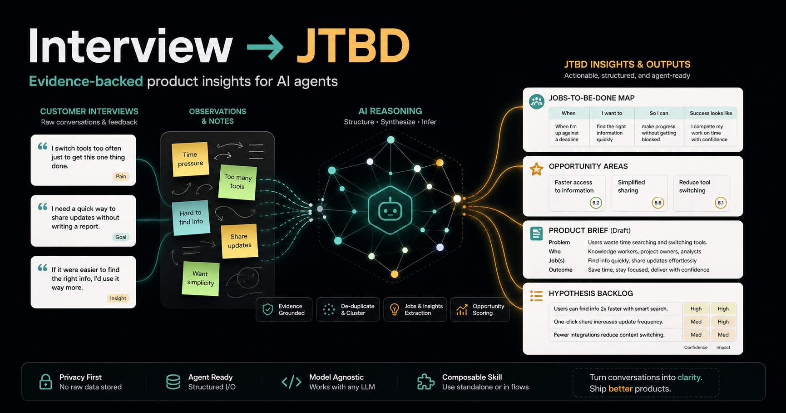

# interview-to-jtbd

Turn messy customer interviews into JTBD maps, opportunity areas, product briefs, and hypothesis backlogs - with evidence, not vibes.

<p align="center">
  
</p>

## Overview

`interview-to-jtbd` is a universal agent skill for analyzing user interviews, research notes, and open-ended customer feedback. It helps an AI agent turn raw materials into an evidence-backed JTBD (Jobs to be Done) map, opportunity map, product brief, hypothesis backlog, and plan for subsequent interviews.

The core idea is not to build a separate SaaS or CLI as the main entry point, but to package the methodology into a portable skill that different AI agents can use: Claude Code, OpenAI Codex, Cursor, Gemini CLI, and any agent that can read `SKILL.md`-style instructions.

## What It Generates

- **JTBD map:** jobs, situations, motivations, expected outcomes, and supporting quotes.
- **Opportunity map:** unmet needs, current workarounds, severity, and product angles.
- **Product brief:** problem framing, target users, constraints, risks, and evidence.
- **Hypothesis backlog:** build-measure-learn hypotheses grounded in research.
- **Follow-up interview guide:** questions for the next discovery round.

## Quick Demo

**Input excerpt**

> "I keep interview notes in three docs, then spend Friday copying quotes into a spreadsheet. By the time I write the roadmap update, I am not sure which quote supports which decision."

**Agent output**

```markdown
## Job: Trace research evidence to product decisions

**Statement:** When I prepare a roadmap or product brief after customer interviews,
I want to connect each decision to the exact evidence behind it,
so I can defend priorities without manually rebuilding the research trail.

**Evidence:**
- "spend Friday copying quotes into a spreadsheet"
- "not sure which quote supports which decision"

**Opportunity:** Reduce the manual work of turning interview notes into traceable product artifacts.

**Hypothesis:** If PMs can generate an evidence table and JTBD map from raw notes,
then they will produce clearer product briefs faster and with fewer unsupported claims.
```

See a fuller example in [`examples/demo-output/customer-research-synthesis.md`](examples/demo-output/customer-research-synthesis.md).

## Prerequisites

- An AI agent that can read repository files: Claude Code, Codex, Cursor, Gemini CLI, or a similar tool.
- Git, if you want to clone the repository.
- Customer interview transcripts, research notes, survey open-ends, support tickets, or other qualitative feedback.
- Optional: an approved local or hosted LLM setup for confidential research data.

No package manager, API key, database, or SaaS account is required by the skill itself.

## Install

### 1. Clone the skill

```bash
git clone https://github.com/lowwwbank/interview-to-jtbd.git
cd interview-to-jtbd
```

### 2. Open it with your agent

Use whichever agent you already work with:

```bash
# Claude Code
claude

# OpenAI Codex
codex

# Gemini CLI
gemini
```

You can also open the folder in Cursor or any editor where your AI agent can read `SKILL.md` and the `references/` directory.

### 3. Point the agent at your research

Put transcripts or notes in a folder such as:

```text
research-notes/
|-- interview-01.md
|-- interview-02.md
`-- survey-open-ends.csv
```

Then ask the agent:

```text
Use SKILL.md as your operating instructions.
Analyze ./research-notes.
Generate an evidence-backed JTBD map, opportunity map, product brief,
hypothesis backlog, and follow-up interview guide.
Do not invent quotes or claims. Mark unsupported assumptions explicitly.
```

### Alternative: install inside another agent workspace

If you already keep agent skills in a project folder, vendor this repository as a subfolder:

```bash
mkdir -p .agents/skills
git clone https://github.com/lowwwbank/interview-to-jtbd.git .agents/skills/interview-to-jtbd
```

Then tell your agent to use `.agents/skills/interview-to-jtbd/SKILL.md`.

### Alternative: copy-paste only

If your agent does not support local skill folders, copy the contents of [`SKILL.md`](SKILL.md) into the agent's custom instructions or prompt window, then paste or attach your research notes.

## Product Positioning

### Category
Agent Skill / AI research synthesis workflow.

### Target Audience
- Product managers doing their own discovery.
- Founders and indie hackers needing to quickly understand customers.
- AI builders who don't want to manually process interviews.
- UX researchers in small teams without budget for Dovetail/Marvin/Condens.
- Product bootcamps, students, product communities.

### Value Proposition
Enterprise research repositories solve the problem of centralized storage and teamwork. `interview-to-jtbd` solves a narrower problem: quickly and reproducibly turning a set of interviews into actionable product artifacts, while preserving the link between every conclusion and its evidence.

**Positioning Formula:** Dovetail-style research synthesis for AI agents and markdown-first teams.

## Market Context
While existing products (Dovetail, Marvin, Condens, Looppanel, Aurelius, Productboard) address broad enterprise/workspace scenarios, `interview-to-jtbd` fills the open niche:
- open-source
- skill-first
- markdown/file-first
- local/privacy-first
- no workspace, billing, onboarding, or SaaS account required
- focuses on JTBD, rather than general qualitative analysis.

## Workflow

```text
Raw interviews      Evidence extraction      JTBD synthesis       Product artifacts
      |                     |                      |                       |
      v                     v                      v                       v
Transcripts  -->  Quotes, observations  -->  Jobs, outcomes  -->  Briefs, hypotheses,
Notes             workarounds, risks         opportunities        follow-up questions
```

## Methodology
Based on:
- JTBD: Users "hire" products to make progress in a specific situation.
- Outcome-Driven Innovation: Focus on job, desired outcomes, unmet needs, and opportunity areas.
- Human-in-the-loop: When using LLMs in qualitative research, human oversight, evidence grounding, and bias mitigation are crucial.

## Design Constraints
The skill is universal and does not depend on a specific AI platform.
- `SKILL.md` is the portable core.
- No `agents/openai.yaml` required in the core.
- Does not rely on OpenAI-only metadata.
- No app installation needed for basic usage.
- No Node/Python needed for basic usage.
- No API key required at the skill level (provider determined by the user's agent).
- Does not store interviews in a third-party service.
- AI synthesis is never presented as fact without evidence.

## Repository Structure

```text
.
|-- SKILL.md
|-- references/
|   |-- jtbd-methodology.md
|   |-- output-schemas.md
|   |-- privacy-and-ethics.md
|   `-- research-synthesis-rubric.md
|-- assets/templates/
|   `-- research-summary.md
`-- examples/demo-output/
    `-- customer-research-synthesis.md
```

## Quality Principles

- Every claim must be traceable to source material.
- Observations, inferences, assumptions, and recommendations must be separated.
- Sparse data should produce lower confidence, not stronger conclusions.
- Personally identifiable information should be anonymized by default.
- The final synthesis should help a human product person make a better decision, not replace judgment.
